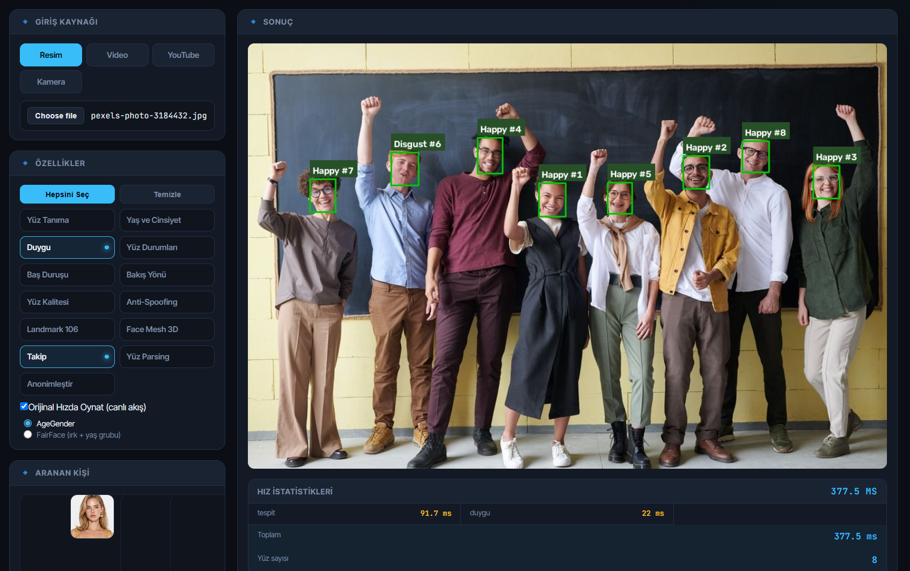

# Face Catch

Real-time face analysis web app built with **Flask + OpenCV + ONNX** ([uniface](https://github.com/yakhyo/uniface) library, CUDA-accelerated).



Runs the full pipeline on **images, video files, YouTube streams and live webcam**, with an H.264 MP4 export of the analyzed result.

## Features

- Face detection & recognition (matching against a "wanted person" reference photo)
- Age / gender, emotion, face quality estimation
- Anti-spoofing (liveness)
- Head pose & gaze direction
- 106-point landmarks, 3D face mesh, face parsing (segmentation)
- Multi-face tracking (BYTETracker)
- Anonymization (face blur) — toggleable
- Live MJPEG stream, on-the-fly feature toggles, per-stage speed stats (ms)
- MP4 export (H.264, faststart) with playable preview

## Quickstart

```bash
python -m venv venv
source venv/bin/activate          # Windows: venv\Scripts\activate
pip install -r requirements.txt
python app.py
```

- Web UI: **http://127.0.0.1:8127**
- Camera tab (getUserMedia requires HTTPS): **https://127.0.0.1:8443** (self-signed)

The app binds to `127.0.0.1` by default. For LAN access:

```bash
UNIFACE_HOST=0.0.0.0 python app.py
```

> ⚠️ The app runs without authentication — only expose it on trusted networks.

ONNX model weights are downloaded automatically on first run to `~/.cache/uniface` (CUDA is used when available).

## Camera tab / TLS certificate

If `certs/` is empty, generate a self-signed certificate:

```bash
mkdir -p certs
openssl req -x509 -newkey rsa:2048 -keyout certs/key.pem -out certs/cert.pem \
  -days 825 -nodes -subj "/CN=uniface.local" \
  -addext "subjectAltName=DNS:localhost,IP:127.0.0.1"
```

## Environment variables

| Variable | Default | Purpose |
|---|---|---|
| `UNIFACE_HOST` | `127.0.0.1` | Bind address (`0.0.0.0` for LAN) |
| `UNIFACE_VENV` | *(auto-detected)* | venv path used to locate CUDA libs for ONNX Runtime |

## Notes

- Uploaded files are renamed to random UUIDs — path traversal is not possible.
- Request body is capped at 1 GB (HTTP 413).
- `certs/`, `uploads/` and `videos/` are gitignored: private keys and personal media never enter the repository.
